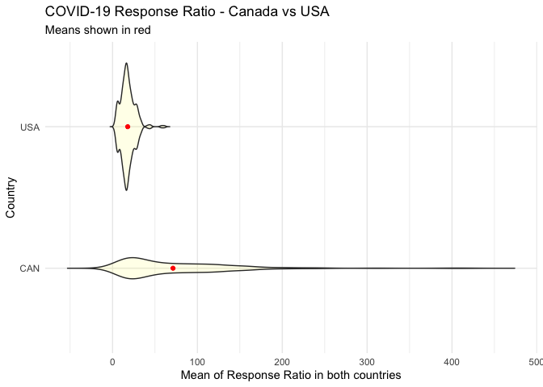
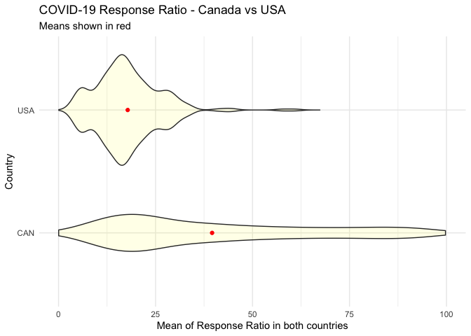

Exoloratory Data Analysis of the Covid-19 Data Set
================

## Summary of the data set

The data set used in this project is a collection of the COVID-19 data
maintained by [Our World in
Data](https://ourworldindata.org/coronavirus). It is updated daily and
includes data on confirmed cases, deaths, hospitalizations and testing,
as well as other variable of potential interests. This data has been
collected, aggregated, and documented by Cameron Appel et
al. \[@owidcoronavirus\]. Various origins have been sourced. Confirmed
cases, deaths, hospitalizations and other related information are
sourced from the European Centre for Disease Prevention and Control
(ECDC). Testing related information are collected by the Our World in
Data team from offical reports. Other sources include United Nations,
World Bank and Global Burden of Disease. More information can be found
[here](https://github.com/owid/covid-19-data/blob/master/public/data/owid-covid-codebook.csv).

## EDA Table

Each row in the data set represents COVID-19 related information for a
given country on a given day starting from 2019-12-31. To limit the
scope of our project, we have chosen the data set that includes
information up to 2020-11-18. Within this data set, there are 57,606
observations and 50 variables. We will be primarily looking at the
COVID-19 data on Canada and USA. Since we are interested in both number
of new cases and number of new tests, any row with missing values in
either column is removed from the date set. We also calculated the
response ratio as defined below:

Response Ratio = \# of daily new tests / \# of daily new cases

Below we have shown the number of observations, mean, median and
standard deviation of response ratio (Table 1).

The mean and median ratio for the USA are close to each other, which
suggests that the ratio for the USA is normally distributed. The mean
response ratio for Canada is higher than the median, so its distribution
seems to be right skewed. This suggests that the true population of
response ratio may not be normally distributed. However, since the
sample size is well above 30, the large enough sample size assumption
under the Central Limit Theorem is met. Therefore the sample observation
does not need to come from a normally distributed population. Because
all conditions of Central Limit Theorem have been met, we decided that
it is safe to use mean response ratio as test statistic for our
hypothesis test.

The standard deviation of Canada is quite large, compared with the mean
and median ratio. It indicates that the response ratio in Canada is more
widely spread out. The standard deviation of the USA is a lot smaller,
which suggests that more of the ratio is clustered around the mean. It
should be noted that the standard deviation might have been affected by
data in the early stage of the pandemic, as tests were not fully
developed and new cases were only detected within a few communities.

``` r
covid_all_country <-  read_csv("data/owid-covid-data.csv", guess_max = 5000)

covid_CAN_USA <- covid_all_country %>% 
    filter(iso_code=="CAN"| iso_code =="USA") %>% 
    filter(date < "2020-11-01") %>% 
    filter(new_cases != 0 & new_tests !=0) %>% 
    select("iso_code", "date", "location", "new_tests", "new_cases") %>% 
    drop_na(new_tests, new_cases) %>% 
    mutate(response_ratio = new_tests/new_cases) 

covid_CAN_USA_summary <-  covid_CAN_USA %>% 
    group_by(iso_code) %>% 
    summarise(sample_size = n(),
              mean_response_ratio = mean(response_ratio),
              median_response_ratio = median(response_ratio),
              standard_dev = sd(response_ratio),
              )
kable(covid_CAN_USA_summary, caption = "Table 1. Summary Statistics of Response Ratio")
```

| iso\_code | sample\_size | mean\_response\_ratio | median\_response\_ratio | standard\_dev |
| :-------- | -----------: | --------------------: | ----------------------: | ------------: |
| CAN       |          227 |              71.22983 |                51.11975 |     64.476327 |
| USA       |          245 |              17.82263 |                16.61308 |      8.480732 |

Table 1. Summary Statistics of Response Ratio

## EDA Plot

To visualize the distribution, we have plotted the distribution of each
country’s response ratio in the histogram below.

The histogram further confirms that the distributions of Canada’s
response ratio is indeed right skewed. In addition, we can see that both
distributions seem to be unimodal but the centre of the distribution
seem to be different. There appears to be a high concentration of the
response ratio between 20 and 50 for Canada and between 10 and 20 for
the USA.

``` r
dist_CAN <- covid_CAN_USA %>% 
    filter(iso_code =="CAN") %>% 
    ggplot(aes(response_ratio)) +
    geom_histogram(bins=50) +
    xlab("Response Ratio, Canada") +
    ggtitle("Sample Distribution of Canada's Response Ratio")

dist_USA <- covid_CAN_USA %>% 
    filter(iso_code =="USA") %>% 
    ggplot(aes(response_ratio)) +
    geom_histogram(bins=50) +
    xlab("Response Ratio, USA") +
    ggtitle("Sample Distribution of USA's Response Ratio")

plot_grid(dist_USA, dist_CAN, ncol=1)
```

<!-- -->

Figure 1. Histogram for Distribution of Response Ratio of Canada and USA

To better understand the entire distribution of the data, we also
plotted the distribution and the mean ratio through violin plot.

``` r
covid_CAN_USA_plot <- covid_CAN_USA %>%
  mutate(across(iso_code, fct_relabel, .fun = str_wrap, width = 30)) %>%
  ggplot(aes(x = response_ratio, y = iso_code)) +
  geom_violin(fill = "yellow", 
              alpha = .1, adjust = .8, trim = FALSE) +
  stat_summary(fun = mean,
               colour = "red",
               geom = "point") +
  scale_x_continuous(labels = scales::label_number_si()) +
  labs(title = "COVID-19 Response Ratio - Canada vs USA",
       subtitle = "Means shown in red",
       x = "Mean of Response Ratio in both countries",
       y = "Country")
covid_CAN_USA_plot
```

<!-- -->

Figure 2. Violin Plot for Distribution of Response Ratio of Canada and
USA

This is a bit hard to see given the outliers. Let’s zoom into our plot
to better highlight differences.

``` r
covid_CAN_USA_plot + 
  scale_x_continuous(limits = c(0, 100))
```

<!-- -->

Figure 3. Violin Plot for Distribution of Response Ratio of Canada and
USA (Removed Outliers)

We can see that the response ratio of USA are mostly clustered around
the mean while the response ratio of Canada are more widely spread.
