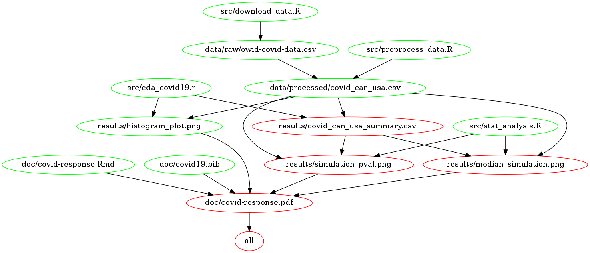

Covid-19 Cases vs Tests Analysis
================
Fatime Selimi, Neel Phaterpekar, Nicholas Wu, Tanmay Sharma

# About

The data set used in this project comes from the Our World in Data
COVID-19 Database created by Hannah Richie et al. \[@owidcoronavirus\].
This data set examines the impact of COVID-19 on countries all over the
world, where daily statistics pertaining to the pandemic from over 200
countries have been recorded each day since December 31st 2019. Each row
in the data set represents a date in a country, where measurements like
total cases, new daily cases, hospital admission rates etc. are
recorded. Data has been collected in conjunction with the World Health
Organization (WHO), the European Center for Disease Prevention and
Control (ECDC) and is available on [Our World in
Data](https://ourworldindata.org/coronavirus) and raw data can be found
[here](https://raw.githubusercontent.com/owid/covid-19-data/master/public/data/owid-covid-data.csv).

With this data, we ask whether there is a difference in the ratio of the
new daily tests performed to the new daily cases between Canada and the
United States. Since the distributions were found to be left skewed and
of unequal variance (see EDA
[here](https://github.com/UBC-MDS/covid-19-cases-vs-tests-analysis/tree/0.1.0/eda)),
we performed a two-tailed hypothesis test checking for the independence
of medians using permutation. With a significance level of 0.05, we
found that there was enough evidence to conclude that the median
response ratio was significantly different between Canada and the United
States (p-value \< 0.0001). This is one way to begin to assess the
different responses and outcomes that these two countries have faced
during the pandemic. However, further analysis is required to better
understand the differences present in the Canada-US responses to
COVID-19.

# Report

The final report can be found
[here](https://github.com/UBC-MDS/covid-19-cases-vs-tests-analysis/blob/main/doc/covid-response.pdf).

# Usage

There are two suggested ways to run this analysis:

### 1\. Using Docker

*note - the instructions in this section also depends on running this in
a unix shell (e.g., terminal or Git Bash)*

To replicate the analysis, install
[Docker](https://www.docker.com/get-started). Then clone this GitHub
repository and run the following command at the command line/terminal
from the root directory of this project:

    docker run --rm -v /$(pwd):/home/rstudio/covid-19-cases-vs-tests-analysis fatse/covid19-cases-vs-tests:v0.8.0 make -C /home/rstudio/covid-19-cases-vs-tests-analysis all

To reset the repo to a clean state, with no intermediate or results
files, run the following command at the command line/terminal from the
root directory of this project:

    docker run --rm -v /$(pwd):/home/rstudio/covid-19-cases-vs-tests-analysis fatse/covid19-cases-vs-tests:v0.8.0 make -C /home/rstudio/covid-19-cases-vs-tests-analysis clean

### 2\. Without using Docker

To replicate the analysis, clone this GitHub repository, install the
[dependencies](#dependencies) listed below, and run the following
commands at the command line/terminal from the root directory of this
project:

    make all 

To reset the repo to a clean state, with no intermediate or results
files, run the following command at the command line/terminal from the
root directory of this project:

    make clean

#### Dependency Diagram of the Makefile

# Dependencies

  - Python 3.8.5 and Python packages:
    
      - docopt==0.6.2
      - pandas==1.1.4
      - numpy
      - altair
      - altair\_saver
      - selenium
      - chromedriver\_binary

  - R version 3.6.1 and R packages:
    
      - knitr==1.29
      - readr==1.3.1
      - tidyverse==1.3.0
      - docopt
      - broom==0.7.1
      - infer==0.5.3
      - cowplot==1.1.0
      - ggplot2
      - kableExtra
      - webshot
      - magick
      - ggthemes

  - GNU make 4.2.1

# License

The materials on analysis about Covid-19 mean response ratio for Canada
and USA are licensed under the MIT License (Copyright (c) 2020 Master of
Data Science at the University of British Columbia). If you want to
re-use/re-mix the analysis and the materials used in this project,
please provide attribution and link to this repository.

# References
