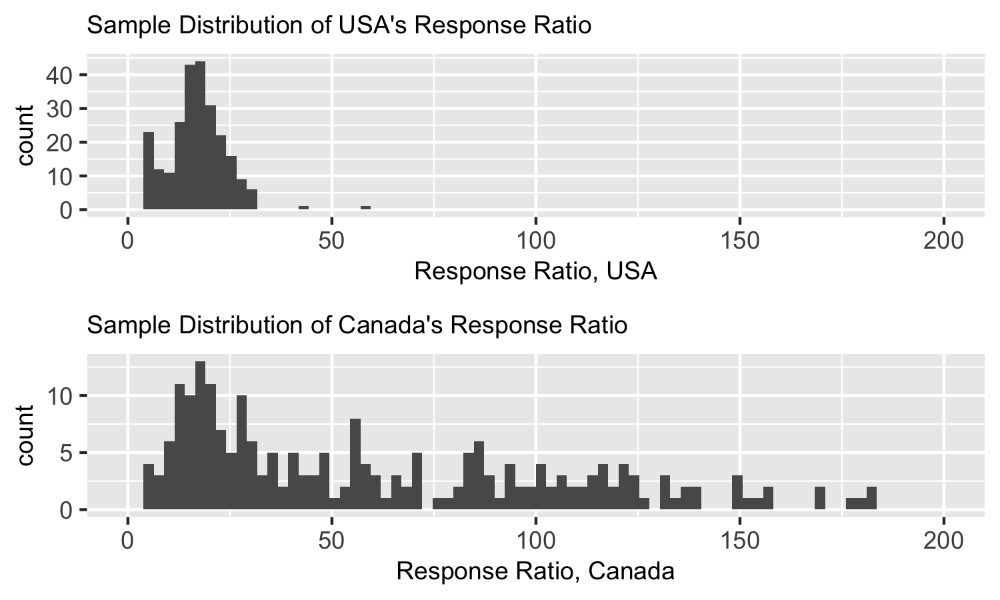
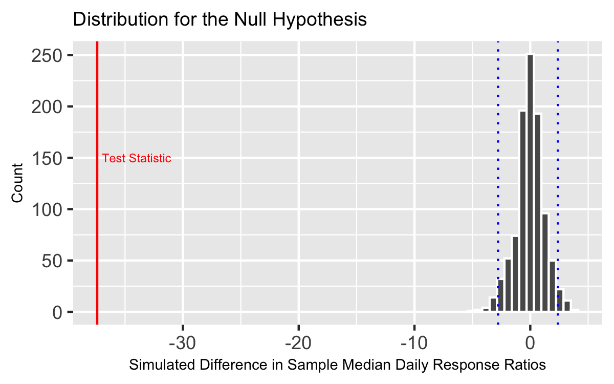

Covid19 Response Ratio Comparison between Canada and USA
================
Fatime Selimi, Neel Phaterpekar, Nicholas Wu, Tanmay Sharma
2020/11/27

  - [Aim](#aim)
  - [Introduction](#introduction)
  - [Project Scope](#project-scope)
  - [Analysis](#analysis)
      - [Data](#data)
      - [Assumptions and limitations](#assumptions-and-limitations)
      - [Methodology](#methodology)
  - [Results & Discussion](#results-discussion)
  - [Future Work](#future-work)
  - [References](#references)

# Aim

This project explores if there is a quantifiable difference in the
Covid-19 responses of Canada and USA as measured through analyzing the
number of daily new cases and daily new tests being conducted in both
the countries between March and October 2020.

# Introduction

Coronavirus disease 2019 (COVID-19) is a contagious disease caused by
the severe acute respiratory syndrome coronavirus 2 (SARS-CoV-2)
(Organization 2020). North-America has been severely impacted by
COVID-19; a quarter of all global deaths as of November 27th, 2020 have
occurred on the continent. Observing the pandemic’s impact at a country
level shows a stark contrast in the number of cases and deaths between
Canada as USA. As of November 27th, 2020, there have been 241,906 deaths
in the US and 11,799 deaths in Canada as per the countries’ official
sources (Disease Control and Prevention 2020, @govCA). Even if we
account for some factors such as population densities, number of
international airports, migration of people, climatic factors, etc. to
understand the varied impact of COVID-19 on Canada and USA it still
seems worthwhile to explore how the response measures of both the
countries have shaped the pandemic’s trajectory since it first broke out
on the continent in January 2020 (Holshue et al. 2020). Moreover, the
widespread coverage and analysis of the COVID-19 in global media as well
as different studies in the academic community have led to a popular
perception that Canada has been able to better respond to the pandemic
than USA. For instance, a study by Jeffrey Lazarus et al.(Lazarus et al.
2020) devised a `covid-score` metric to quantify the government response
measures for different countries and ranked Canada (score = 61.00) much
better than the USA (covid-score = 50.57). This project attempts a
preliminary analysis of the COVID-19 data regarding daily cases and
tests being conducted in Canada and USA to understand the response of
the these two neighbors to one of the deadliest pandemics that the world
has seen in decades.

# Project Scope

Epidemiology is a complex science and there are a myriad factors that
can shape the course of a pandemic or determine how fatal its impact
would be across a given population and timeframe. Modeling global
pandemics and quantifying effectiveness of response measures is an even
more challenging task as conspicuously observed throughout 2020 during
the different phases of COVID-19 (Li et al. 2020). This project is a
first step towards trying to analyze the efficacy of Canadian and
American responses towards COVID-19. The authors of this
project(hereafter referred to as `the team`) have deliberately
restricted the scope of the analysis to a simple statistical question
and focused on building a well-rounded project-flow instead through the
incorporation of some of the best practices for data science. The team
has drawn inspiration from the principles and adages elucidated upon in
Dr.Peng’s quintessential work, `The Art of Data Science`(Roger D. Peng
2016).

# Analysis

\#\#The Question

We’ve defined response ratio to be the ratio of the daily new COVID-19
viral detection tests conducted to the daily new COVID-19 confirmed
cases.

\[ \texttt{Response Ratio} = \frac{\text{Daily New COVID-19 Viral Detection Tests Conducted Nationally}}{\text{Daily New COVID-19 Confirmed Cases Nationally}} \]

The statistical question being probed in this project is, `Is there a
difference in the median daily response ratio of Canada and USA between
March 1st 2020 and October 31st 2020?`

The team feels that the question presents an opportunity to meaningfully
explore COVID-19 data through a simple statistical analysis and stays
true to the project scope as discussed in the section above. The
question provides a stepping stone towards helping develop a prefatory
understanding of COVID-19 responses in Canada and USA and can be built
upon further through more robust analyses. The team acknowledges that
there are several assumptions and limitations associated with this
analysis and they are discussed in the relevant sections below.

## Data

The data set used in this project comes from the `Our World in Data
COVID-19` database created by Hannah Richie et al. (Max Roser and Hasell
2020). This data set examines the impact of COVID-19 on countries all
over the world; the data set comprises daily statistics pertaining to
the pandemic from over 200 countries recorded since December 31st 2019.
Each row in the data set represents a date in a country, where
measurements like total cases, new daily cases, hospital admission rates
etc. are recorded. Data has been collected in conjunction with the World
Health Organization (WHO), the European Center for Disease Prevention
and Control (ECDC) and is available on [Our World in
Data](https://ourworldindata.org/coronavirus) and raw data can be found
[here](https://raw.githubusercontent.com/owid/covid-19-data/master/public/data/owid-covid-data.csv).

## Assumptions and limitations

1.  We’ve restricted the time-line for consideration to be between March
    1st 2020 and October 31st 2020.
2.  The choice of timeline is further explained in our Exploratory Data
    Analysis reports under the eda folder.
3.  We acknowledge that it is impossible to gather data regarding the
    true population of confirmed COVID-19 cases and the viral detection
    tests being conducted.
4.  Our sample sizes for both Canada and USA while calculating daily
    response ratios are limited by the data as present in our data set.
5.  We acknowledge that the nature of our data set is temporal and that
    there will be autocorrelation within each country’s response rate
    calculations.
6.  Our analysis seeks to establish a simple comparison with no attempts
    to infer causality and/or other overarching conclusions about either

## Methodology

The team performed extensive EDA to wrangle the data and make it
suitable for further analysis. Details of the EDA process are captured
in our reports under the eda folder which can be found
[here](https://github.com/UBC-MDS/covid-19-cases-vs-tests-analysis/tree/main/eda).

Firstly, we calculated the daily response ratio for both Canada and USA
for the time-line of interest using the daily new\_tests and new\_cases
columns found in the data set. We analyzed the distribution of the daily
response ratio for both the countries during the time-line of interest
as shown in the figure below.

 Figure 1. Sample Distribution of
Daily Response Ratio for USA and Canada between March 1st 2020 and
October 31st 2020.

We analyzed and confirmed that there is a difference in the variances of
distributions of the daily response ratio data for both Canada and USA
during the time-line of interest through a Bartlett’s test.

The team decided to use permutation based hypothesis testing to answer
our statistical question. We chose a 95% confidence level for our sample
estimate i.e a significance threshold level of $ = 0.05 $ .

Our Null(\(H_0\)) and Alternate(\(H_a\)) Hypothesis are:

$ H\_0: The median daily response ratio of Canada and USA between March
1st 2020 and October 31st 2020 is equal $ $ H\_a: The median daily
response ratio of Canada and USA between March 1st 2020 and October 31st
2020 is not equal $

We generated a bootstrap distribution of bootstrap sample median
response ratios for Canada and USA during the time-line of interest. We
visualized our booststrap distributions as shown in the figure below.

 Figure 2. Bootstrap Distribution
of the Difference in Median Daily Response Ratios for USA and Canada
between March 1st 2020 and October 31st 2020.

Thereafter, we calculated the p-value for our hypothesis test. The
results are discussed in the section below.

The R (R Core Team 2019) and Python (Van Rossum and Drake 2009)
programming languages were used to perform the analysis in this project.
The following R and Python packages were used: knitr (Xie 2014) and
tidyverse (Wickham 2017). All the code used in the analysis can be found
at
<https://github.com/UBC-MDS/covid-19-cases-vs-tests-analysis/tree/main/src>.

# Results & Discussion

The p-value for our test was \<0.0001. Based on this p-value, since it
is much lower than our significance threshold of 0.05 we reject our Null
Hypothesis that the median daily response ratio of Canada and USA
between March 1st 2020 and October 31st 2020 is equal.

Our results are summarized in the table below.

Table 1. Results Summary.

Based on our analysis we can-not categorically say that Canada’s overall
response strategy towards COVID-19 was more efficient that that of USA;
however, we can infer with reasonable confidence that the median daily
response ratio as defined within the confines of our earlier stated
assumptions was higher for Canada than USA between March 1st 2020 and
October 31st 2020.

We also acknowledge that there are some pitfalls such as selection-bias,
random-variability, and sampling-variability (Roger D. Peng 2016) which
our analysis doesn’t address owing to the scope of the project as
explained earlier.

# Future Work

Our analysis can be be built upon further to devise a more sophisticated
framework to understand COVID-19 responses in Canada and USA. Some of
the interesting points which would help expand the scope of this project
include: - Include more robust data, for e.g. finding data for some of
the missing days in the current data set. - Expand the time-line of
consideration for the analysis. - Address the auto-correlation caused by
the temporal nature of the daily data points by using appropriate
time-series analysis techniques. - Explore more features to include in
quantifying the `Response Ratio`. - Build a model to take into account
the other relevant features as discovered in the point above.

# References

Canada, Government of. 2020. “COVID-19 Situational Awareness Dashboard.”
<https://health-infobase.canada.ca/covid-19/dashboard/>.

Disease Control, Centers for, and Prevention. 2020. “COVID-19 Death Data
and Resources.”
<https://www.who.int/emergencies/diseases/novel-coronavirus-2019>.

Holshue, Michelle L., Chas DeBolt, Scott Lindquist, Kathy H. Lofy, John
Wiesman, Hollianne Bruce, Christopher Spitters, et al. 2020. “First Case
of 2019 Novel Coronavirus in the United States.” *The New England
Journal of Medicine* 382 (10): 929–36.

Lazarus, Jeffrey V., Scott Ratzan, Adam Palayew, Francesco C. Billari,
Agnes Binagwaho, Spencer Kimball, Heidi J. Larson, et al. 2020.
“COVID-Score: A Global Survey to Assess Public Perceptions of
Government Responses to Covid-19 (Covid-Score-10).” *PLoS One* 15 (10).
<https://ezproxy.library.ubc.ca/login?url=https://www-proquest-com.ezproxy.library.ubc.ca/docview/2448834819?accountid=14656>.

Li, Jie, Daniel Q. Huang, Biyao Zou, Hongli Yang, Wan Z. Hui, Fajuan
Rui, Natasha T. S. Yee, et al. 2020. “Epidemiology of Covid‐19: A
Systematic Review and Meta‐analysis of Clinical Characteristics, Risk
Factors, and Outcomes.” *Journal of Medical Virology*.

Max Roser, Esteban Ortiz-Ospina, Hannah Ritchie, and Joe Hasell. 2020.
“Coronavirus Pandemic (Covid-19).” *Our World in Data*.

Organization, World Health. 2020. “Novel-Coronavirus-2019.”
<https://www.cdc.gov/nchs/nvss/vsrr/covid19/index.htm>.

R Core Team. 2019. *R: A Language and Environment for Statistical
Computing*. Vienna, Austria: R Foundation for Statistical Computing.
<https://www.R-project.org/>.

Roger D. Peng, Elizabeth Matsui. 2016. *The Art of Data Science*.

Van Rossum, Guido, and Fred L. Drake. 2009. *Python 3 Reference Manual*.
Scotts Valley, CA: CreateSpace.

Wickham, Hadley. 2017. *Tidyverse: Easily Install and Load the
’Tidyverse’*. <https://CRAN.R-project.org/package=tidyverse>.

Xie, Yihui. 2014. “Knitr: A Comprehensive Tool for Reproducible Research
in R.” In *Implementing Reproducible Computational Research*, edited by
Victoria Stodden, Friedrich Leisch, and Roger D. Peng. Chapman;
Hall/CRC. <http://www.crcpress.com/product/isbn/9781466561595>.

